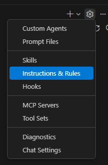

Start VS Code opening an OpenFOAM empty folder
Connect to Github Copilot Agent

Create a new `openfoam.instructions`instruction file under your ./github/instructions folder 

Copy the content of the `openfoam.instructions.md` into the newly created `openfoam.instructions` file

same with Slurm instructions

create an openfoamjob prompt file
